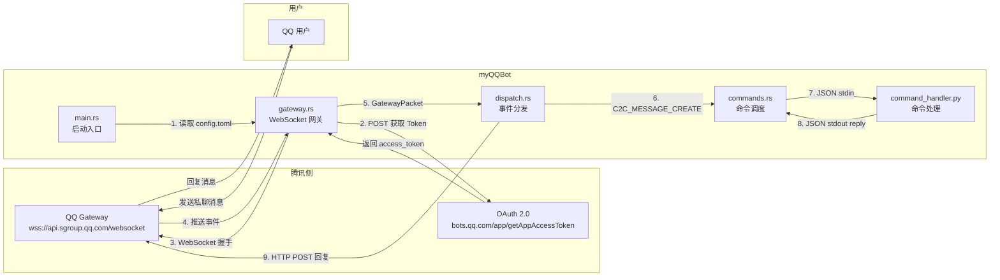

# myQQBot

基于 **Rust** 和 **QQ 官方机器人 API** 的轻量级私聊机器人，支持通过 Python 脚本热加载命令，无需重新编译即可扩展功能。

## 项目架构



## 功能特性

- **WebSocket 长连接** — 基于 [`tokio-tungstenite`](https://crates.io/crates/tokio-tungstenite) 实现稳定的 QQ 官方 Gateway 连接，自动心跳保活
- **Token 自动获取** — 启动时通过 OAuth 2.0 Client Credentials 流程获取 Bearer Token
- **断线自动重连** — 连接断开后自动等待 3 秒重连，无需人工干预
- **Python 热加载命令** — 命令处理逻辑由 [`scripts/command_handler.py`](scripts/command_handler.py) 实现，修改命令无需重新编译 Rust 二进制
- **子进程自动恢复** — Python 处理进程崩溃后自动重启，保证服务可用性

## 快速开始

### 前置条件

- [Rust](https://www.rust-lang.org/) 1.80+（edition 2024）
- Python 3.8+
- 一个 [QQ 开放平台](https://q.qq.com/) 机器人应用

### 1. 克隆项目

```bash
git clone https://github.com/your-username/myQQBot.git
cd myQQBot
```

### 2. 配置凭证

```bash
cp config.toml.example config.toml
```

编辑 [`config.toml`](config.toml.example)，填入你的机器人凭证：

```toml
appid = "你的 APP_ID"
appsecret = "你的 APP_SECRET"
node_name = "你的节点名称（如 AliyunHK）"
```

> `appid` 和 `appsecret` 可在 [QQ 开放平台](https://q.qq.com/) → 你的应用 → 开发设置 中获取。

### 3. 运行

```bash
cargo run
```

首次运行会自动下载依赖并编译，之后直接启动机器人。

## 项目结构

```
myQQBot/
├── Cargo.toml              # Rust 项目配置与依赖
├── config.toml.example     # 配置文件模板
├── .gitignore
├── scripts/
│   └── command_handler.py  # Python 命令处理脚本（热加载）
└── src/
    ├── main.rs             # 启动入口：读取配置、连接网关、事件循环
    ├── gateway.rs          # WebSocket 网关模块：Token 获取、握手、心跳、消息读取
    ├── dispatch.rs         # 事件分发模块：解析事件类型、发送 HTTP 回复
    └── dispatch/
        └── commands.rs     # 命令调度模块：通过 stdin/stdout 与 Python 进程通信
```

## 模块说明

### [`src/main.rs`](src/main.rs)
程序入口。读取 [`config.toml`](config.toml.example)，循环调用 [`gateway::connect_gateway()`](src/gateway.rs:100) 建立连接，并在连接断开时自动重连。

### [`src/gateway.rs`](src/gateway.rs)
WebSocket 网关模块，核心功能：
- [`get_access_token()`](src/gateway.rs:173) — 向腾讯 OAuth 端点 POST 凭证，获取 Bearer Token
- [`establish_ws()`](src/gateway.rs:216) — 建立 WebSocket 连接，解析 Hello 帧，发送 Identify 握手
- [`server_start()`](src/gateway.rs:113) — 主循环：定时发送心跳包 + 读取网关推送事件
- [`read_ws()`](src/gateway.rs:304) — 从 WebSocket 流中读取并解析 GatewayPacket

### [`src/dispatch.rs`](src/dispatch.rs)
事件分发模块：
- [`handle_packet()`](src/dispatch.rs:36) — 根据事件类型（如 `C2C_MESSAGE_CREATE`）分发到对应处理函数
- [`handle_packet_c2c_message_create()`](src/dispatch.rs:10) — 处理私聊消息，调用命令匹配并发送回复
- [`send_c2c_reply()`](src/dispatch.rs:46) — 通过 HTTP API 向用户发送私聊回复，含自动重试

### [`src/dispatch/commands.rs`](src/dispatch/commands.rs)
命令调度模块：
- 使用 [`LazyLock<Mutex<Child>>`](src/dispatch/commands.rs:24) 维护 Python 子进程单例
- 通过 JSON Lines 协议与 Python 进程通信
- 管道断裂时自动重启子进程

### [`scripts/command_handler.py`](scripts/command_handler.py)
Python 命令处理脚本：
- 从 stdin 读取 JSON：`{"content": "...", "node_name": "..."}`
- 向 stdout 输出 JSON：`{"reply": "..."}` 或 `{"reply": null}`
- 30 秒无输入自动退出（空闲超时保护）
- 内置命令：`/你好` — 返回服务器 CPU、内存、磁盘 IO 状态

## 添加自定义命令

编辑 [`scripts/command_handler.py`](scripts/command_handler.py) 中的 `COMMANDS` 列表：

```python
COMMANDS = [
    ("/你好", lambda n: f"【{n}】🤖 机器人已就绪\n\n..."),
    ("/ping", lambda n: "pong!"),
    ("/time", lambda n: f"当前时间: {__import__('datetime').datetime.now()}"),
]
```

每个命令是一个 `(触发关键词, 处理函数)` 元组。处理函数接收 `node_name` 参数，返回回复字符串或 `None`（不回复）。修改后**无需重启 Rust 进程**，Python 脚本会在下次调用时自动生效。
